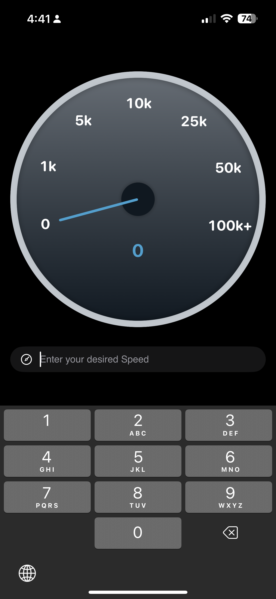

Speedometer

A sleek and customizable SwiftUI speedometer gauge designed to visually represent real-time data like speed, progress, or any other scalar value on a radial scale. Ideal for automotive dashboards, fitness trackers, or data visualization apps.

Features
	• SwiftUI-native and fully customizable
	• Smooth spring animations
	• Gradient background and progress arcs
	• Radial tick mark labels
	• Custom needle hand with dynamic movement
	• Adaptive layout using GeometryReader

Components
	• SpeedometerView: The main component rendering the full gauge
	• Speedometer Hand: Represents the moving needle
	• TickMarkLabel: Shows numeric labels around the dial
	• ProgressArcView: Shows progress based on current value

Example Usage

SpeedometerView(
    currentValue: 72
)
.frame(width: 300, height: 300)

Although usage is already given in the RootView.

Customization
	• Customize gradient colors in SpeedometerView+Content.swift
	• Modify the needle style in SpeedometerHand.swift

🧪 TODOs
	• Add min/max threshold indicators
	• Make it fully accessible with VoiceOver
	• Unit test the angle/position calculations

👨‍💻 Author

Sobhan Asim
Reach out on LinkedIn or GitHub for feedback and suggestions for improvement.
